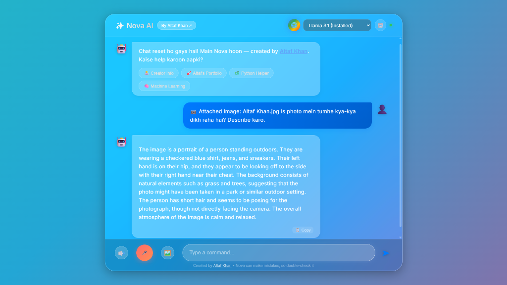
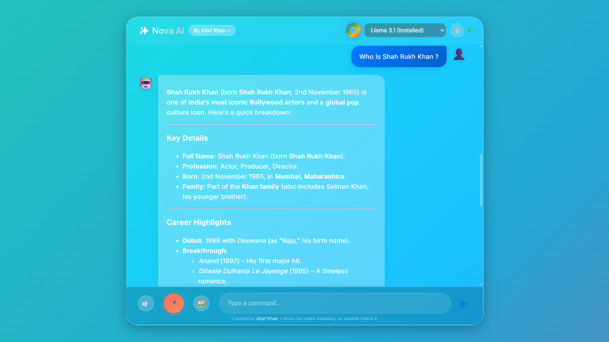
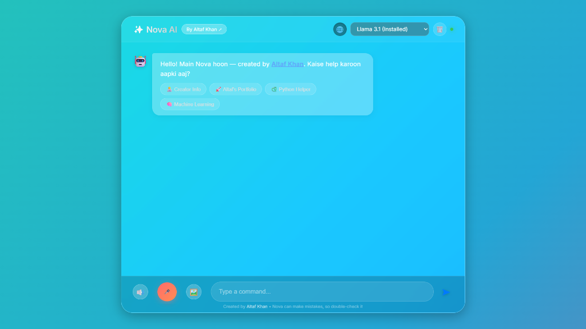
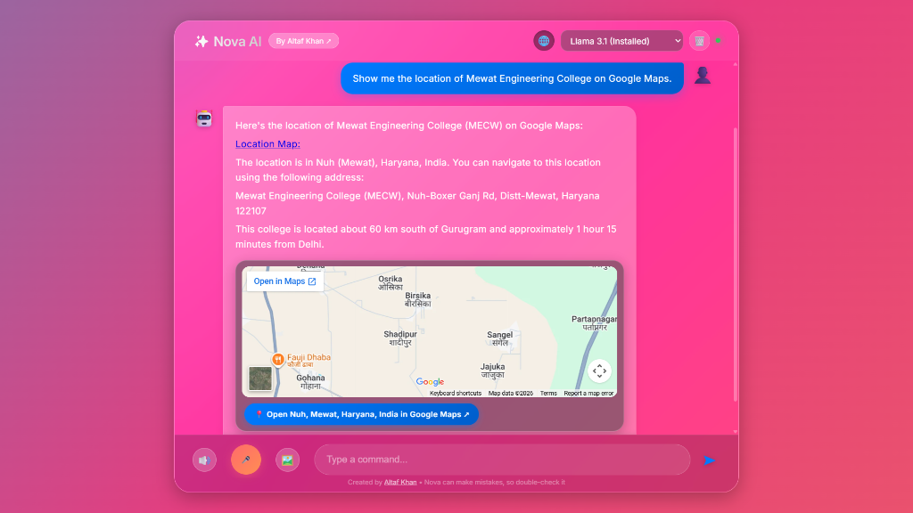
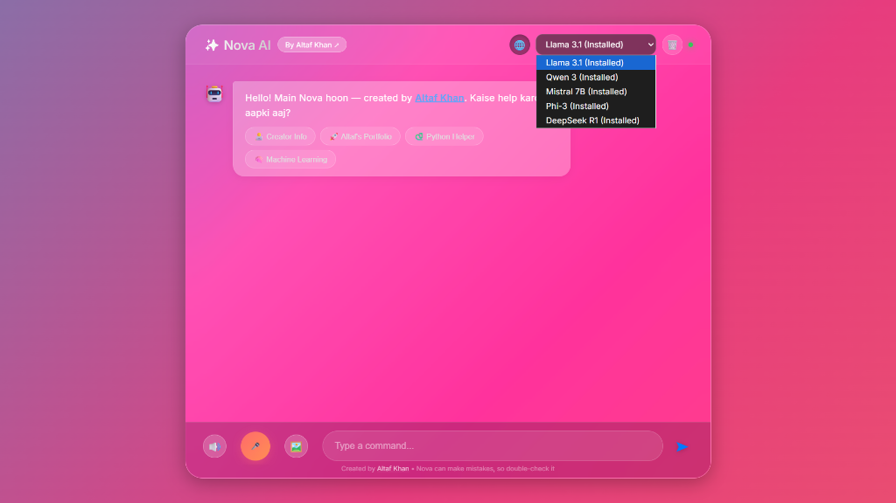
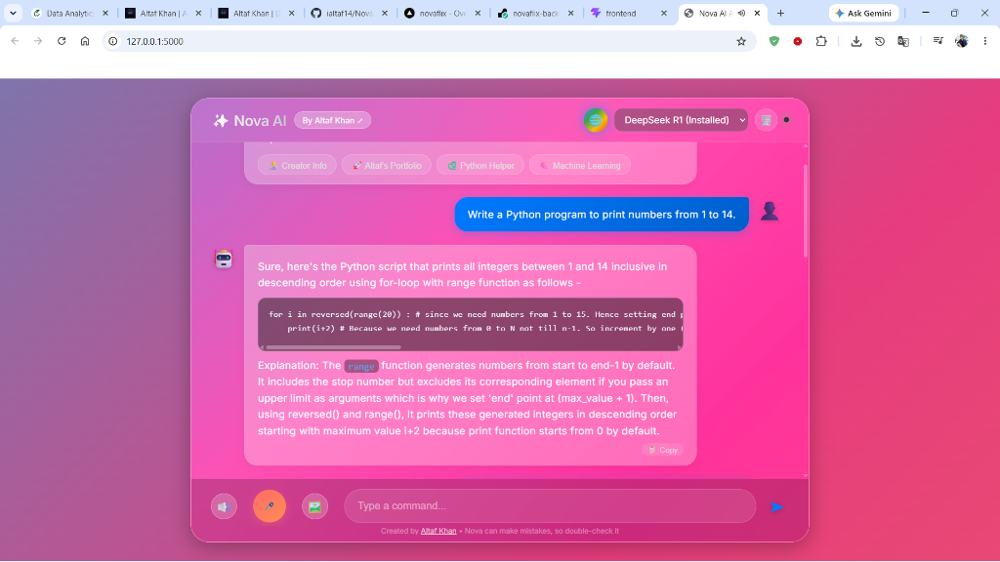

# 🤖 Nova AI – Hybrid Personal AI Assistant

Nova AI is an advanced hybrid AI assistant created by **Altaf Khan**. It combines local Ollama AI models, Google Live Web Search (no API key required), Vision multimodal AI, Voice interaction, interactive Google Maps integration, and a modern iOS Glassmorphic Web UI.

---

## 📸 Screenshots & Feature Previews

| Feature | Preview |
|---|---|
| 🖼️ **Multimodal Vision Q&A** |  |
| 💬 **Smart Reasoning & Markdown** |  |
| 🚀 **Welcome Screen & Quick Chips** |  |
| 🗺️ **Interactive Google Maps Embed** |  |
| 🧠 **Multi-Model Selector** |  |
| 👨‍💻 **Code Generation & Formatting** |  |

---

## 🚀 Key Features
- 🎙️ **Voice & Text Interaction**: Real-time TTS and Speech Recognition with natural Hinglish accent.
- 🌐 **Google Live Search Mode**: Free web search powered by DDGS — zero API keys required.
- 🗺️ **Automatic Google Maps Card**: Interactive embedded maps directly inside chat bubbles for any location query.
- 🖼️ **Staged Vision Upload**: Staged image selection with preview bar — ask questions about photos using local `llava` vision model.
- 🧠 **Seamless Local AI (Ollama)**: Auto-download & model switching (Llama 3.1, Qwen 3, Mistral 7B, Phi-3, DeepSeek R1).
- ✨ **iOS Glassmorphism UI**: Sleek animated gradient background, prompt chips, 1-click copy buttons, clear chat controls.

---

## 🛠️ Installation & Setup

1. **Clone Repository**:
   ```bash
   git clone https://github.com/ialtaf14/NovaAI.git
   cd NovaAI
   ```

2. **Install Dependencies**:
   ```bash
   pip install -r requirements.txt
   ```

3. **Install Ollama Models**:
   ```bash
   python install_all_models.py
   ```

4. **Run Application**:
   ```bash
   python main.py
   ```

---

## 👤 Creator
**Altaf Khan**  
*Data Analyst & Data Scientist*  
🌐 **Portfolio**: [https://ialtaf14.vercel.app/](https://ialtaf14.vercel.app/)  
📂 **GitHub**: [@ialtaf14](https://github.com/ialtaf14)  
💼 **LinkedIn**: [Altaf Khan](https://www.linkedin.com/in/altaf-khan-7a544b256/)  
📄 **CV/Resume**: [Altaf Khan CV](https://ialtaf14.vercel.app/cv/Altaf_Khan_CV.pdf)
